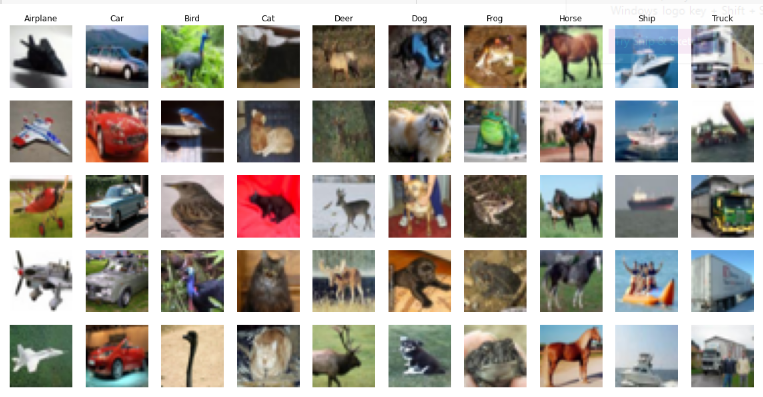

# Image Classification using Machine learning models, KNN from scratch, LR, SVM models using CIFAR-10 dataset. 

## Description:
This project uses machine laerning models to classify images using CIFAR-10 dataset which contain about 60.000 images 
, then applying KNN model from scrach , SVM model , Logistic regression for Image Classification.and this is a viualization for five samples for each class.

## Conclosion:
The First Model: KNN classifier, the highest accuracy=0.276 at K= 33 by using manhatten distance .

The Second Model: Logistic Regression classifer, The argMax of the probabilities for each model from the 10 models= 0.33

The Third Model: SVM Classifer, the highest accuracy =0.484 when applying the optimal combination of values for the cost=100 and gamma =0.01 ,so the champion model which brings the best accuracy is SVM Classifer.

